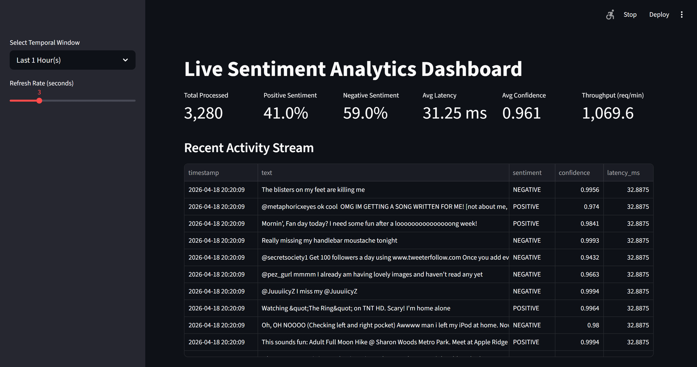

# Real-Time Sentiment Analytics System

A high-throughput, end-to-end sentiment analysis pipeline built with **FastAPI**, **DistilBERT**, and **Streamlit**.
The system processes concurrent text streams, persists predictions to an async SQLite database, and surfaces live KPIs on an auto-refreshing dashboard.

<p align="center">
  
</p>

---

## Architecture Overview

```
pipeline/data_feeder.py
        |
        | HTTP POST /predict (50 concurrent batches)
        v
backend/main_api.py (FastAPI + DistilBERT INT8)
        |
        | async background task
        v
backend/database.py (aiosqlite)
        |
        | SQL query (temporal window)
        v
utils/metrics.py → app.py (Streamlit Dashboard)
```

These three processes run in parallel and are orchestrated by `run.sh`.

---

## Features
 
- Batch inference on up to 100 texts per request via a locally quantized DistilBERT model (INT8, no retraining)
- Non-blocking async database writes using `aiosqlite` background tasks
- Concurrent load simulation firing 50 async requests/cycle via `aiohttp`
- Live KPI dashboard with configurable temporal windows (1h / 6h / 24h) and refresh rate
- Rule-based alert engine for sentiment spikes, latency degradation, and low-confidence predictions
- `/health` and `/metrics` endpoints for uptime and inference monitoring
---

## Project Structure

```
├── backend/
|   ├── database.py          # Async SQLite init, batch inserts, metric queries
|   ├── error_handlers.py    # FastAPI global exception handlers (422, 500)
|   └── main_api.py          # Core API: DistilBERT inference, /predict, /health, /metrics
|
├── data/
|   └── sentiment_data.csv   # Source dataset used by the data feeder
|
├── models/
|   └── optimize.py          # Model optimization utilities
|
├── pipeline/
|   └── data_feeder.py       # Async concurrent HTTP load simulator
|
├── utils/
|   ├── alerts.py            # Real-time threshold-based alert engine
|   └── metrics.py           # KPI calculation and temporal data fetching
|
├── app.py                   # Streamlit dashboard entry point
├── requirements.txt
└── run.sh
```

---

## Dashboard

The Streamlit dashboard auto-refreshes at a configurable interval (1-10 seconds) and displays:

| Metric | Description |
|---|---|
| Total Processed | Cumulative records in the selected time window |
| Positive Sentiment | Percentage of POSITIVE predictions |
| Negative Sentiment | Percentage of NEGATIVE predictions |
| Avg Latency | Mean per-record inference time in milliseconds |
| Avg Confidence | Mean model confidence score (0-1) |
| Throughput | Requests processed per minute |

A live activity stream table shows the 15 most recent predictions with full text, sentiment label, confidence, and latency.

---

## Setup

### 1. Download the model

The API expects a locally saved DistilBERT sentiment model at `./local_model/`. To download and save it:

```python
pyhton .\models\optimize.py
```

### 2. Download the dependencies

> PyTorch is listed as a comment in `requirements.txt`. For setup having GPU, uncomment the PyTorch keyword.

For CPU-only setup:

```bash
pip install torch torchvision torchaudio --index-url [https://download.pytorch.org/whl/cpu](https://download.pytorch.org/whl/cpu)
```

Then:

```bash
pip install -r requirements.txt
```

### 3. Prepare dataset

Place your input CSV at `data/sentiment_data.csv`. The data feeder reads text from the last column of the file. The included dataset is a Twitter sentiment corpus.

### 4. Launch the system through Git Bash

```bash
chmod +x run.sh
./run.sh
```

`run.sh` starts all three processes in sequence:

`FastAPI backend` → `Async data feeder` → `Streamlit dashboard`

Stopping the dashboard (Ctrl+C) will also terminate the backend and feeder processes via the `EXIT` trap.

---

## API Reference

#### `POST /predict`

Run batch sentiment inference.

**Request body:**

```json
{
  "texts": ["I love this!", "This is terrible."]
}
```

**Response:**

```json
{
  "batch_latency_ms": 45.2,
  "results": [
    { "sentiment": "POSITIVE", "confidence": 0.9987 },
    { "sentiment": "NEGATIVE", "confidence": 0.9954 }
  ]
}
```

#### `GET /health`

```json
{
  "status": "healthy",
  "uptime_seconds": 3612.4,
  "model_loaded": true
}
```

#### `GET /metrics`

```json
{
  "uptime_hours": 1.0,
  "total_processed": 3280,
  "average_inference_latency_ms": 31.25
}
```

---

## Alert Thresholds

Alerts are evaluated against the most recent 100 records on every dashboard refresh.

| Alert Level | Condition |
|---|---|
| ERROR | Negative sentiment ratio > 70% for last 100 texts |
| WARNING | Average inference latency > 200ms |
| NOTICE | More than 20 predictions with confidence < 0.50 |

---

## Performance

Tested on CPU with INT8 dynamic quantization applied at startup:

- Average inference latency: ~31ms per record
- Throughput: ~1,069 requests/min (50 concurrent clients)
- Model confidence: avg ~0.961 across Twitter sentiment dataset
